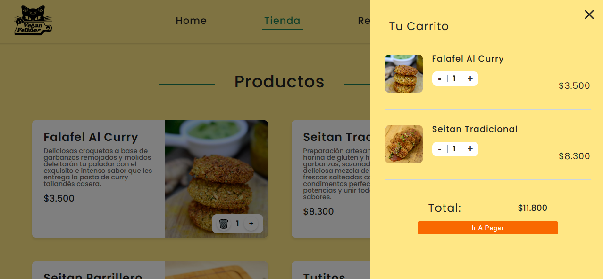
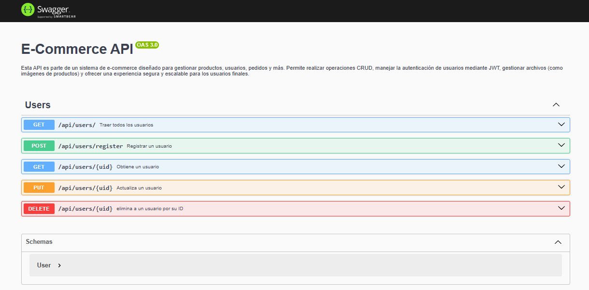
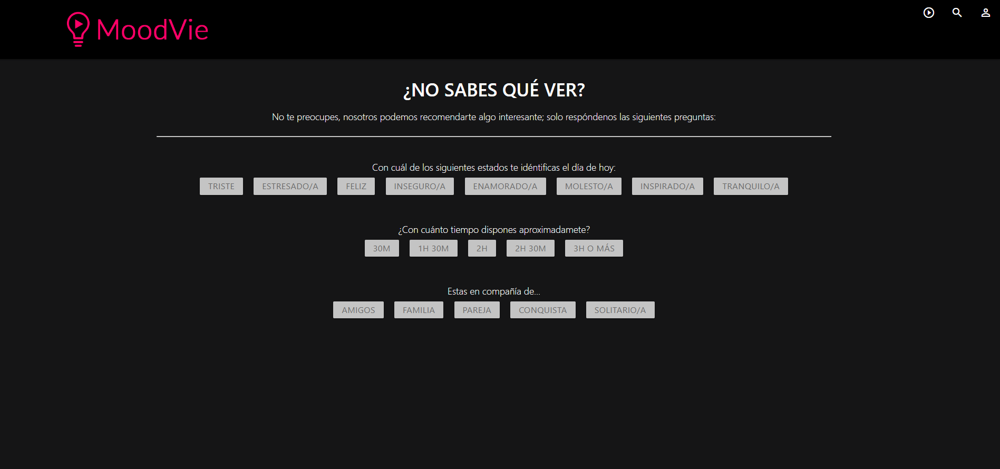
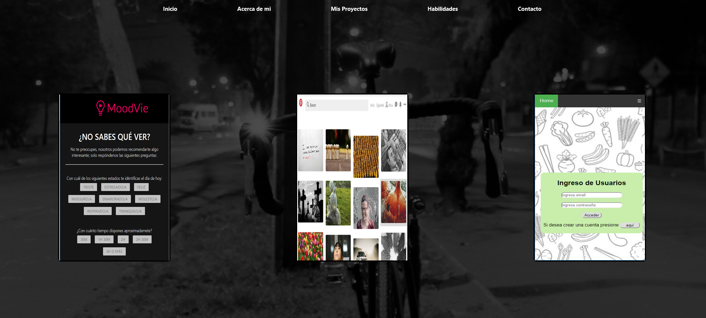

+

<h1 align="center">Hola, soy MoluDev👋</h1>

## Sobre mi

- 🌟 **¿Quién soy?** Soy una desarrolladora Full-Stack con experiencia en aplicaciones web, Frot-end, APIs, Backend, ecommerce,
- 🌱 **Aprendiendo actualmente:** Actualmente estoy aprendiendo Next.js y herramientas de AWS
- ✨ **Me encanta:** Colaborar en proyectos de código abierto y aprender nuevas tecnologías.
   

## Skills

  
  
  
  
  
  
  
  
  
  
  
  
  
  
  
  

## Proyectos

<table>
<tr>
<td width="50%">
<h3 align="center">Vegan Felino</h3>

 Proyecto desarrollado con tecnologías modernas que garantizan una experiencia de usuario rápida, dinámica y visualmente atractiva. El objetivo del proyecto es ofrecer una <strong> interfaz intuitiva y funcional </strong> para los usuarios, aprovechando las mejores herramientas del ecosistema de desarrollo web actual.

                                                                                      
</td>

<td width="50%">
                
<h3 align="center">Backend E-commerce</h3>

                                       

 

Esta API es parte de un sistema de e-commerce diseñado para gestionar productos, usuarios, pedidos y más. Permite realizar operaciones CRUD, manejar la autenticación de usuarios mediante JWT, gestionar archivos (como imágenes de productos) y ofrecer una experiencia segura y escalable para los usuarios finales.

                                                             
</table>                                                                                 

 

<table>
<tr>
<td width="50%">
<h3 align="center">MoodVie</h3>

"MoodVie" es una plataforma para personas que buscan recomendaciones de películas, cuando no saben que ver. A través de una serie de preguntas te puede mostrar la película que estabas buscando.

                                                                                      
</td>

<td width="50%">
<h3 align="center">Mi primer portafolio año 2019</h3>

Mi primer portafolio, desarrollado en 2019, representa los inicios de mi trayectoria como desarrollador web. Incluye una muestra de proyectos enfocados en interfaces simples y funcionales, destacando mi interés por crear experiencias interactivas. 

                                                                                      
</td>  
</table>                                                                                 

 
